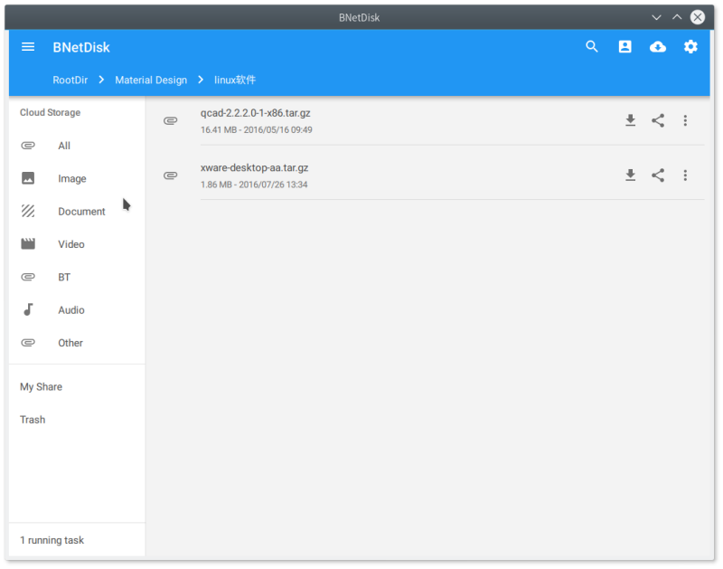
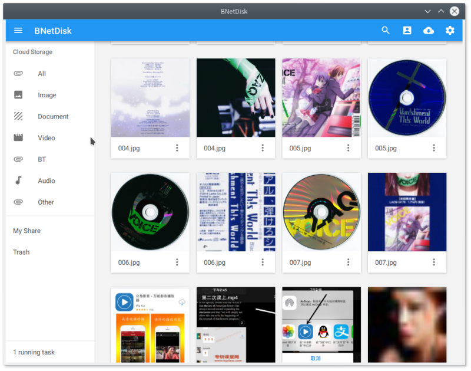
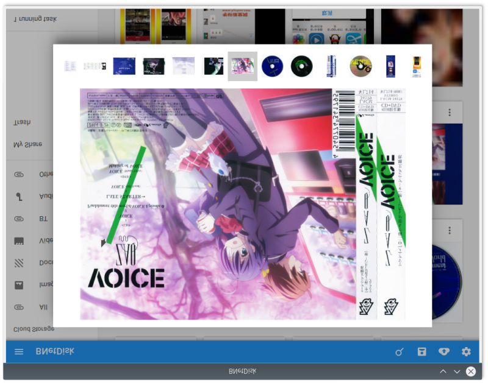
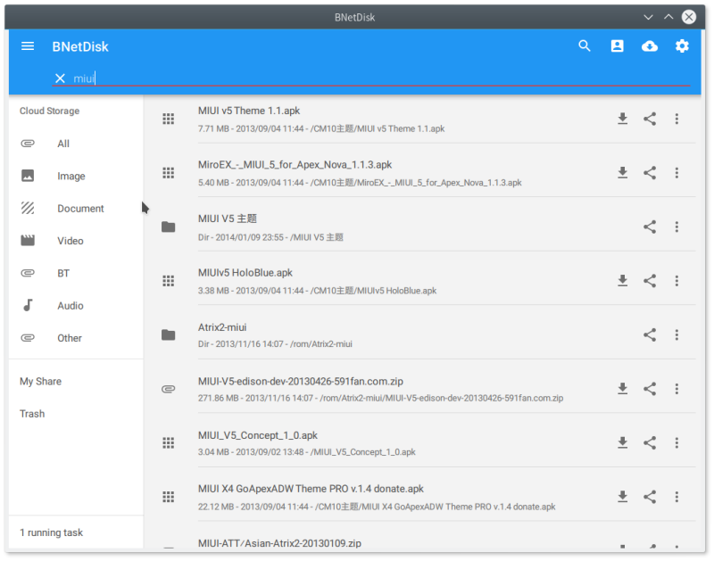

 BNetDisk
=========================

基于Qt5/qml，使用google material design的第三方百度网盘客户端。

 
 
 
 

目前支持以下功能
--------
* 文件多线程下载
* 基础的网盘文件管理功能(删除和重命名)
* 文件共享(支持私人和公开共享)
* 网盘文件搜索
* 支持按照文件类型分类浏览
* 支持管理网盘回收站和共享的文件


待添加功能
--------
* 文件上传
* 网盘文件目录移动
* 更多下载模块的功能管理


编译
-----------
```bash
git clone https://github.com/SunRain/BNetDisk.git
cd BNetDisk
git submodule update --init --recursive
mkdir build
cd build
qmake ..
make
...
```

项目使用了以下模块，感谢
-----------
* qml-material - https://github.com/papyros/qml-material
* quickflux - https://github.com/benlau/quickflux


